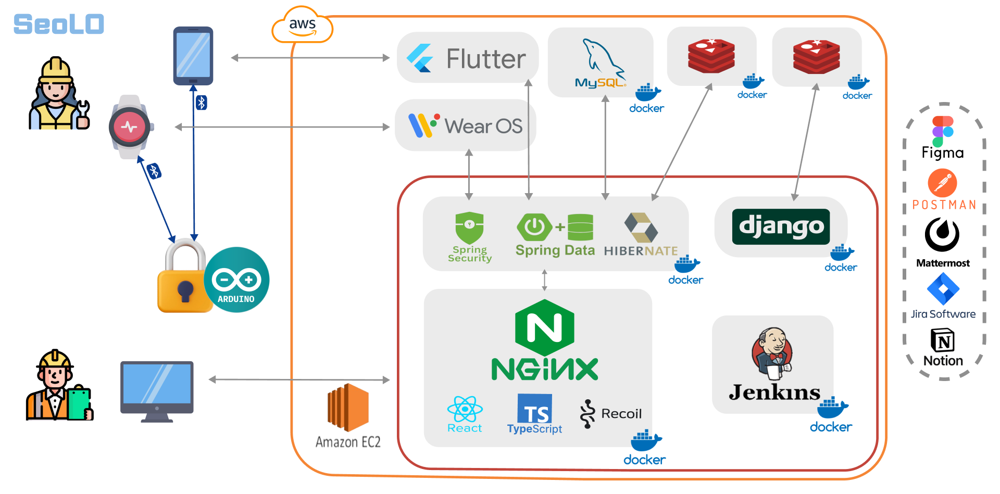

# SEOLO(Safe+Easy Our LOTO)

> **안전은 로또가 아닙니다. 새로운 로토 서비스** 
> 서로에서 작업자들의 안전을 기원합니다.

## 수상 내역

> **자율프로젝트 우수상 수상(1등)** 

상금 240만원 
삼성전자주식회사

## 목차

[1. 주요 기능](#1-주요-기능) 
[2. 세부 기능](#2-세부-기능) 
[3. 인증 로직](#3-인증-로직) 
[4. 아키텍처](#4-아키텍처) 
[5. 사용 예시](#5-사용-예시) 
[6. 포팅 매뉴얼](#6-개발-설정) 
[7. 프로젝트 구조](#7-프로젝트-구조-설명) 
[8. 팀원](#8-팀원) 

## 1. 주요 기능

> 🚨[LOTO 통합 크로스플랫폼 서비스]🚨 
> 🔒안전은 LOTTO가 아닙니다.🔓

1. BLE를 활용한 LOTO 활동 지원
2. 작업장, 작업자, 체크리스트 관리 기능
3. 작업 일지와 활동에 따른 자동 보고서 생성 및 내보내기 기능
4. LOTO활동에 따른 알림 기능

## 2. 세부 기능

> 관리자와 작업자를 위한 맞춤 기능을 제공합니다.
> 관리자는 WEB, APP, WATCH, LOCK을, 작업자는 APP, WATCH, LOCK을 사용할 수 있습니다.

세부기능 살펴보기

| 순서 | WEB                                                                                                                                                           | APP                                                                                                                                  | WATCH                                                                                                                                | LOCK                                  |
| ---- | ------------------------------------------------------------------------------------------------------------------------------------------------------------- | ------------------------------------------------------------------------------------------------------------------------------------ | ------------------------------------------------------------------------------------------------------------------------------------ | ------------------------------------- |
| 1    | LOTO 일지 관리 (자동 보고서 생성) - 작업자가 작성한 LOTO 일지 확인 - 인명 피해 생긴 경우 일지 수정 기능 - 자동 LOTO 보고서 생성 및 csv 내보내기 기능 | LOTO 자물쇠 잠금 및 해제 기능 - 본인이 잠갔을 경우에만 잠금 및 해제 가능 - 관리자의 경우에만 타 작업자가 잠근 자물쇠 해제 가능 | LOTO 자물쇠 잠금 및 해제 기능 - 본인이 잠갔을 경우에만 잠금 및 해제 가능 - 관리자의 경우에만 타 작업자가 잠근 자물쇠 해제 가능 | BLE기반 잠금/잠금해제                 |
| 2    | LOTO 자물쇠 관리 - 자물쇠 LOCK/UNLOCK 상태 및 배터리 관리                                                                                                  | 작업 일지 작성 기능 - 회사별 체크리스트 모두 점검 후 일지 작성 - 일지 작성 시 자동으로 보고서 생성                             | 작업 일지 작성 기능 - 회사별 체크리스트 모두 점검 후 일지 작성 - 일지 작성 시 자동으로 보고서 생성                             | RFID 마스터키 잠금 해제               |
| 3    | LOTO 혹은 기타 안전 체크리스트 관리 - 기본 제공 안전 체크리스트 제공 - 회사별 커스텀 체크리스트 설정 기능                                               | 타 작업자의 잠금 내용 확인 기능 - 타 작업자가 작업 시 내용 확인                                                                   | PIN 잠금 지원으로 사번 로그인보다 편리한 사용                                                                                        | 타 회사 사람 접근 제한(블루투스 끊기) |
| 4    | 작업장 및 장비 관리 - 작업장 도면 등록 - 장비 등록 - 작업장의 도면에 장비 위치 설정 - 장비별 담당자 설정 - 장비별 작업 상태 확인               | LOTO 절차 확인 - LOTO 절차 확인 가능                                                                                              |                                                                                                                                      | C타입 충전 기능                       |
| 5    | 작업자 관리 - 작업자 등록                                                                                                                                  | 본인이 작성한 작업 내역 확인 가능                                                                                                    |                                                                                                                                      |                                       |
| 6    | 회사 현황 조회 (대시보드) - 작업통계, 재해현황 등 - 작업 시 알림 제공                                                                                   | PIN 잠금 지원으로 사번 로그인보다 편리한 사용                                                                                        |                                                                                                                                      |                                       |
| 7    |                                                                                                                                                               | 주기적 업데이트되는 안전 뉴스 제공 - 안전 경각심 고취                                                                             |                                                                                                                                      |                                       |

## 3. 인증 로직

> 인증 로직으로, 서비스를 위한 주요 검증 내용을 담고 있습니다.

[인증로직 보러가기](docs/AuthLogic.md)

## 4. 아키텍처

## 5. 사용 예시

> 사진과 gif를 활용해 사용 예시를 보여줍니다.

[사용예시 보러가기](docs/Usage.md)

## 6. 포팅 메뉴얼

- [포팅 메뉴얼](docs/Porting%20Guide.pdf)

## 7. 프로젝트 구조

> 프로젝트 구조 설명입니다. 폴더구조에 대한 설명과 선택적으로 기여 및 분담내용을 담고 있습니다.

- [BE - seolo](backend/README.md)
- [BE - news](backend/news/README_BE_news.md)
- [EMBEDDED](embedded/README_EM.md)
- [FE - web](frontend/web/README.md)
- [FE - app](frontend/app/README.md)
- [FE - watch](frontend/watch/README.md)
- [DevOps](DevOps/README.MD)

## 8. 팀원

| 이름   | 역할                          |
| ------ | ----------------------------- |
| 오유진 | 팀장, BE, EMB, 최종발표, 시연 |
| 김진명 | BE, INFRA                     |
| 오민상 | FE(WATCH), EMB(회로), 시연    |
| 오정민 | FE(WEB)                       |
| 이현비 | FE(APP), 시연                 |
| 조형찬 | EMB, CSS, UCC편집, 기획발표   |
