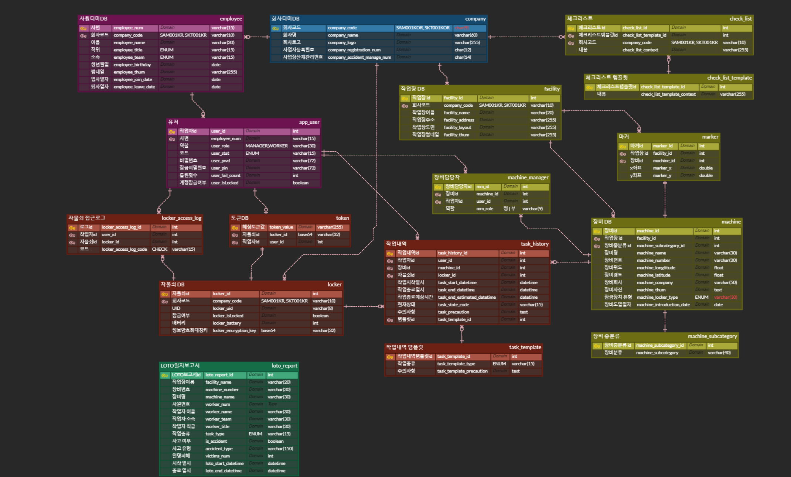

# 🕸 ERD



# 📁메인 백엔드 서버 디렉토리 구조

## 리소스
```
📦resources 
 ┣ 📂confidence -> 비밀키 저장소 (서브모듈)
 ┃ ┣ 📂.idea
 ┃ ┃ ┣ 📜.gitignore
 ┃ ┃ ┣ 📜misc.xml
 ┃ ┃ ┣ 📜modules.xml
 ┃ ┃ ┣ 📜seolo-config.iml
 ┃ ┃ ┗ 📜vcs.xml
 ┃ ┣ 📜.git
 ┃ ┗ 📜application-secret.yml
 ┣ 📂dummy -> 개발 서버 더미 쿼리
 ┃ ┗ 📜data.sql
 ┣ 📜application-dev.yml
 ┣ 📜application-local.yml
 ┣ 📜application-prod.yml
 ┣ 📜application.properties
 ┗ 📜application.yml
```


## 도메인
### 알람
✅ 관리자가 장비, 자물쇠의 작업현황을 실시간으로 확인할 수 있는 알람기능
```
📦alarm
 ┣ 📂controller
 ┃ ┗ 📜NotificationController.java
 ┣ 📂dto
 ┃ ┗ 📂request
 ┃ ┃ ┣ 📜AlarmRequest.java
 ┃ ┃ ┗ 📜NotificationSendRequest.java
 ┗ 📂service
 ┃ ┣ 📜AlarmService.java
 ┃ ┗ 📜NotificationService.java
```
### LOTO 체크리스트
✅ LOTO 작업 전, 작업자가 확인해야햐는 체크리스트의 조회, 추가 기능
```
📦checklist
 ┣ 📂controller
 ┃ ┗ 📜CheckListController.java
 ┣ 📂dto
 ┃ ┣ 📂info
 ┃ ┃ ┣ 📜CheckListInfo.java
 ┃ ┃ ┗ 📜CheckListTemplateInfo.java
 ┃ ┣ 📂request
 ┃ ┃ ┗ 📜CheckListRequest.java
 ┃ ┣ 📂response
 ┃ ┃ ┗ 📜GetCheckListResponse.java
 ┃ ┣ 📜CheckListDto.java
 ┃ ┗ 📜CheckListTemplateDto.java
 ┣ 📂entity
 ┃ ┣ 📜CheckList.java
 ┃ ┗ 📜CheckListTemplate.java
 ┣ 📂exception
 ┃ ┗ 📜CheckListErrorCode.java
 ┣ 📂repository
 ┃ ┣ 📜CheckListRepository.java
 ┃ ┗ 📜CheckListTemplateRepository.java
 ┗ 📂service
 ┃ ┣ 📂impl
 ┃ ┃ ┗ 📜CheckListServiceImpl.java
 ┃ ┗ 📜CheckListService.java
```

### 자물쇠잠금 코어로직
✅ 자물쇠 잠금,풀기,확인 및 토큰 발급 등 비즈니스 핵심 로직
```
📦core
 ┣ 📂controller
 ┃ ┣ 📜CoreController.java
 ┃ ┗ 📜LockerController.java
 ┣ 📂dto
 ┃ ┣ 📂info
 ┃ ┃ ┗ 📜LockerInfo.java
 ┃ ┣ 📂request
 ┃ ┃ ┣ 📜CoreRequest.java
 ┃ ┃ ┣ 📜LockerEnrollRequest.java
 ┃ ┃ ┗ 📜LockerRequest.java
 ┃ ┣ 📂response
 ┃ ┃ ┣ 📜CheckMoreResponse.java
 ┃ ┃ ┣ 📜CoreResponse.java
 ┃ ┃ ┗ 📜LockerResponse.java
 ┃ ┣ 📜LockerDto.java
 ┃ ┗ 📜TokenDto.java
 ┣ 📂entity
 ┃ ┣ 📜Locker.java
 ┃ ┣ 📜LockerAccessLog.java
 ┃ ┗ 📜Token.java
 ┣ 📂enums
 ┃ ┗ 📜CODE.java
 ┣ 📂exception
 ┃ ┣ 📜CoreErrorCode.java
 ┃ ┣ 📜CoreTokenErrorCode.java
 ┃ ┗ 📜LockerErrorCode.java
 ┣ 📂repository
 ┃ ┣ 📜LockerAccessLogRepository.java
 ┃ ┣ 📜LockerRepository.java
 ┃ ┗ 📜TokenRepository.java
 ┗ 📂service
 ┃ ┣ 📂impl
 ┃ ┃ ┣ 📜CoreServiceImpl.java
 ┃ ┃ ┣ 📜CoreTokenServiceImpl.java
 ┃ ┃ ┣ 📜LockerAccessLogServiceImpl.java
 ┃ ┃ ┗ 📜LockerServiceImpl.java
 ┃ ┣ 📂states
 ┃ ┃ ┣ 📜CHECK.java
 ┃ ┃ ┣ 📜INIT.java
 ┃ ┃ ┣ 📜ISSUE.java
 ┃ ┃ ┣ 📜LOCK.java
 ┃ ┃ ┣ 📜LOCKED.java
 ┃ ┃ ┗ 📜UNLOCK.java
 ┃ ┣ 📜CodeState.java
 ┃ ┣ 📜Context.java
 ┃ ┣ 📜CoreService.java
 ┃ ┣ 📜CoreTokenService.java
 ┃ ┣ 📜LockerAccessLogService.java
 ┃ ┗ 📜LockerService.java
```

### 작업장(공장)
✅ 작업장별로 나누어 장비, LOTO 등을 관리
```
📦facility
 ┣ 📂controller
 ┃ ┗ 📜FacilityController.java
 ┣ 📂dto
 ┃ ┣ 📂info
 ┃ ┃ ┗ 📜FacilityInfo.java
 ┃ ┣ 📂request
 ┃ ┃ ┗ 📜FacilityRequest.java
 ┃ ┣ 📂response
 ┃ ┃ ┣ 📜FacilityBlueprintResponse.java
 ┃ ┃ ┗ 📜FacilityListResponse.java
 ┃ ┗ 📜FacilityDto.java
 ┣ 📂entity
 ┃ ┗ 📜Facility.java
 ┣ 📂exception
 ┃ ┗ 📜FacilityErrorCode.java
 ┣ 📂repository
 ┃ ┗ 📜FacilityRepository.java
 ┗ 📂service
 ┃ ┣ 📂impl
 ┃ ┃ ┗ 📜FacilityServiceImpl.java
 ┃ ┗ 📜FacilityService.java
```

### 장비
✅ 해당 회사, 작업장이 가지고 있는 기기장비의 등록,수정,조회 등의 로직
```
📦machine
 ┣ 📂controller
 ┃ ┗ 📜MachineController.java
 ┣ 📂dto
 ┃ ┣ 📂info
 ┃ ┃ ┣ 📜MachineInfo.java
 ┃ ┃ ┣ 📜MachineListInfo.java
 ┃ ┃ ┗ 📜MachineManagerInfo.java
 ┃ ┣ 📂request
 ┃ ┃ ┣ 📜MachineRequest.java
 ┃ ┃ ┗ 📜ReportUpdateRequest.java
 ┃ ┣ 📂response
 ┃ ┃ ┣ 📜MachineListForChoiceResponse.java
 ┃ ┃ ┗ 📜MachineListResponse.java
 ┃ ┣ 📜MachineDto.java
 ┃ ┣ 📜MachineIdName.java
 ┃ ┣ 📜MachineInfo.java
 ┃ ┣ 📜MachineListDto.java
 ┃ ┗ 📜MachineSpaceDto.java
 ┣ 📂entity
 ┃ ┣ 📜Machine.java
 ┃ ┣ 📜MachineManager.java
 ┃ ┗ 📜MachineSubcategory.java
 ┣ 📂enums
 ┃ ┣ 📜LockerType.java
 ┃ ┗ 📜Role.java
 ┣ 📂exception
 ┃ ┗ 📜MachineErrorCode.java
 ┣ 📂repository
 ┃ ┣ 📜MachineManagerRepository.java
 ┃ ┗ 📜MachineRepository.java
 ┗ 📂service
 ┃ ┣ 📂impl
 ┃ ┃ ┗ 📜MachineServiceImpl.java
 ┃ ┗ 📜MachineService.java
```

### 도면 마커
✅ 메인화면 도면에 표시하는 자물쇠, 장비의 작업상태 마커 등록,조회 로직
```
📦marker
 ┣ 📂controller
 ┃ ┗ 📜MarkerController.java
 ┣ 📂dto
 ┃ ┣ 📂request
 ┃ ┃ ┗ 📜AddMarkerRequest.java
 ┃ ┣ 📂response
 ┃ ┃ ┣ 📜AddMarkerResponse.java
 ┃ ┃ ┣ 📜MarkerInfoResponse.java
 ┃ ┃ ┗ 📜MarkerLocationResponse.java
 ┃ ┣ 📜MarkerDto.java
 ┃ ┗ 📜MarkerLocation.java
 ┣ 📂entity
 ┃ ┗ 📜Marker.java
 ┣ 📂exception
 ┃ ┗ 📜MarkerErrorCode.java
 ┣ 📂repository
 ┃ ┗ 📜MarkerRepository.java
 ┗ 📂service
 ┃ ┣ 📂impl
 ┃ ┃ ┗ 📜MarkerServiceImpl.java
 ┃ ┗ 📜MarkerService.java
```

### 보고서
✅ 작업이 완료된 LOTO 작업일지를 저장,조회하는 보고서 기능
```
📦marker
 ┣ 📂controller
 ┃ ┗ 📜MarkerController.java
 ┣ 📂dto
 ┃ ┣ 📂request
 ┃ ┃ ┗ 📜AddMarkerRequest.java
 ┃ ┣ 📂response
 ┃ ┃ ┣ 📜AddMarkerResponse.java
 ┃ ┃ ┣ 📜MarkerInfoResponse.java
 ┃ ┃ ┗ 📜MarkerLocationResponse.java
 ┃ ┣ 📜MarkerDto.java
 ┃ ┗ 📜MarkerLocation.java
 ┣ 📂entity
 ┃ ┗ 📜Marker.java
 ┣ 📂exception
 ┃ ┗ 📜MarkerErrorCode.java
 ┣ 📂repository
 ┃ ┗ 📜MarkerRepository.java
 ┗ 📂service
 ┃ ┣ 📂impl
 ┃ ┃ ┗ 📜MarkerServiceImpl.java
 ┃ ┗ 📜MarkerService.java
```

### 작업내역
✅ 작업자가 진행중인 LOTO의 정보를 확인할 수 있는 작업내역 기능
```
📦task
 ┣ 📂controller
 ┃ ┣ 📜TaskController.java
 ┃ ┗ 📜TaskTemplateController.java
 ┣ 📂dto
 ┃ ┣ 📂info
 ┃ ┃ ┗ 📜TaskHistoryInfo.java
 ┃ ┣ 📂mapper
 ┃ ┃ ┗ 📜TaskTemplateMapper.java
 ┃ ┣ 📂request
 ┃ ┃ ┗ 📜TaskHistoryAddRequest.java
 ┃ ┣ 📂response
 ┃ ┃ ┣ 📜RenameTaskTemplateResponse.java
 ┃ ┃ ┣ 📜TaskHistoryResponse.java
 ┃ ┃ ┣ 📜TaskListResponse.java
 ┃ ┃ ┗ 📜TaskTemplateResponse.java
 ┃ ┣ 📜RenameTaskTemplate.java
 ┃ ┣ 📜TaskHistoryDto.java
 ┃ ┗ 📜TaskTemplateDto.java
 ┣ 📂entity
 ┃ ┣ 📜TaskHistory.java
 ┃ ┗ 📜TaskTemplate.java
 ┣ 📂enums
 ┃ ┣ 📜TASKSTATUS.java
 ┃ ┗ 📜TASKTYPE.java
 ┣ 📂exception
 ┃ ┣ 📜TaskErrorCode.java
 ┃ ┗ 📜TaskTemplateErrorCode.java
 ┣ 📂repository
 ┃ ┣ 📜TaskHistoryRepository.java
 ┃ ┗ 📜TaskTemplateRepository.java
 ┗ 📂service
 ┃ ┣ 📂impl
 ┃ ┃ ┣ 📜TaskHistoryServiceImpl.java
 ┃ ┃ ┗ 📜TaskTemplateServiceImpl.java
 ┃ ┣ 📜TaskHistoryService.java
 ┃ ┗ 📜TaskTemplateService.java
```

### 앱유저
✅ 회사에 등록된 사원 중 '서로' 앱을 이용할 수 있도록 등록된 유저 기능 
```
📦user
 ┣ 📂controller
 ┃ ┗ 📜UserController.java
 ┣ 📂dto
 ┃ ┣ 📂info
 ┃ ┃ ┗ 📜UserListInfo.java
 ┃ ┣ 📂request
 ┃ ┃ ┣ 📜UserJoinRequest.java
 ┃ ┃ ┣ 📜UserLoginRequest.java
 ┃ ┃ ┣ 📜UserPwdCheckRequest.java
 ┃ ┃ ┗ 📜UserPwdResetRequest.java
 ┃ ┗ 📂response
 ┃ ┃ ┣ 📜UserInfoResponse.java
 ┃ ┃ ┣ 📜UserJoinResponse.java
 ┃ ┃ ┣ 📜UserListResponse.java
 ┃ ┃ ┗ 📜UserLoginResponse.java
 ┣ 📂entity
 ┃ ┗ 📜AppUser.java
 ┣ 📂enums
 ┃ ┗ 📜ROLES.java
 ┣ 📂exception
 ┃ ┣ 📂validation
 ┃ ┃ ┣ 📜ComplexPasswordValidator.java
 ┃ ┃ ┗ 📜PasswordConstraint.java
 ┃ ┗ 📜UserErrorCode.java
 ┣ 📂repository
 ┃ ┗ 📜UserRepository.java
 ┗ 📂service
 ┃ ┣ 📂impl
 ┃ ┃ ┗ 📜UserServiceImpl.java
 ┃ ┗ 📜UserService.java
```

## 글로벌
```angular2html
📦global

┣ 📂common -
┃ ┣ 📜BaseEntity.java
┃ ┗ 📜CompanyCodeInterceptor.java
┣ 📂config 
┃ ┣ 📂Listener
┃ ┃ ┗ 📜SessionDestroyedListener.java
┃ ┣ 📜AsyncConfig.java
┃ ┣ 📜HttpSessionConfig.java
┃ ┣ 📜JpaAuditConfig.java
┃ ┣ 📜JwtProperties.java
┃ ┗ 📜MvcConfig.java
```

### 암호화
✅ 코어인증토큰에 필요한 AES128 암/복호화 및  Base64 인/디코딩 관련 로직
```
┣ 📂encryption
┃ ┣ 📂exception
┃ ┃ ┗ 📜AesEncryptionErrorCode.java
┃ ┗ 📜AesEncryption.java
┣ 📂exception
┃ ┣ 📜AuthException.java
┃ ┣ 📜CommonException.java
┃ ┣ 📜GlobalExceptionHandler.java
┃ ┗ 📜SeoloErrorResponse.java
```

### AWS S3
✅ 각종 이미지 저장을 위한 AWS S3 세팅 및 업로드 로직
```
┣ 📂s3
┃ ┣ 📂config
┃ ┃ ┗ 📜AwsS3Config.java
┃ ┣ 📂controller
┃ ┃ ┗ 📜AmazonS3Controller.java
┃ ┣ 📂dto
┃ ┃ ┗ 📂response
┃ ┃ ┃ ┣ 📜S3ManyFilesResponse.java
┃ ┃ ┃ ┗ 📜S3OneFileResponse.java
┃ ┣ 📂exception
┃ ┃ ┗ 📜S3ErrorCode.java
┃ ┗ 📂service
┃ ┃ ┗ 📜AmazonS3Service.java
```

### 스프링 시큐리티 + JWT
✅ 크로스플랫폼을 위한 JWT 기반 인증 로직 <br>
✅ 관리자 / 작업자로 구분되는 인가 로직 <br>
✅ 세션 인증을 위한 스켈레톤 코드
```
┣ 📂security
┃ ┣ 📂config
┃ ┃ ┣ 📜AuthorityConfig.java
┃ ┃ ┗ 📜SecurityConfig.java
┃ ┣ 📂dto
┃ ┃ ┣ 📂request
┃ ┃ ┃ ┣ 📜PINLoginRequest.java
┃ ┃ ┃ ┗ 📜PINResetRequest.java
┃ ┃ ┗ 📂response
┃ ┃ ┃ ┣ 📜JwtLoginSuccessResponse.java
┃ ┃ ┃ ┣ 📜LoginFailureResponse.java
┃ ┃ ┃ ┣ 📜LoginSuccessResponse.java
┃ ┃ ┃ ┣ 📜LogoutSuccessResponse.java
┃ ┃ ┃ ┣ 📜PINLoginFailureResponse.java
┃ ┃ ┃ ┗ 📜PINLoginResponse.java
┃ ┣ 📂entity
┃ ┃ ┗ 📜DaoCompanycodeToken.java
┃ ┣ 📂enums
┃ ┃ ┗ 📜DEVICETYPE.java
┃ ┣ 📂exception
┃ ┃ ┣ 📜AuthErrorCode.java
┃ ┃ ┣ 📜CustomAuthenticationEntryPoint.java
┃ ┃ ┗ 📜JwtErrorCode.java
┃ ┣ 📂filter
┃ ┃ ┗ 📜DaoCompanyCodeAuthenticationFilter.java
┃ ┣ 📂handler
┃ ┃ ┣ 📜CustomAccessDeniedHandler.java
┃ ┃ ┣ 📜SeoloLoginFailureHandler.java
┃ ┃ ┣ 📜SeoloLoginSuccessHandler.java
┃ ┃ ┗ 📜SeoloLogoutSuccessHandler.java
┃ ┣ 📂jwt
┃ ┃ ┣ 📂dto
┃ ┃ ┃ ┗ 📂response
┃ ┃ ┃ ┃ ┗ 📜IssuedToken.java
┃ ┃ ┣ 📂entity
┃ ┃ ┃ ┣ 📜CCodePrincipal.java
┃ ┃ ┃ ┣ 📜InvalidJwtToken.java
┃ ┃ ┃ ┣ 📜JWTAuthenticationToken.java
┃ ┃ ┃ ┗ 📜JwtToken.java
┃ ┃ ┣ 📂filter
┃ ┃ ┃ ┗ 📜JwtValidationFilter.java
┃ ┃ ┣ 📂repository
┃ ┃ ┃ ┣ 📜InvalidTokenRepository.java
┃ ┃ ┃ ┗ 📜JwtTokenRepository.java
┃ ┃ ┣ 📂service
┃ ┃ ┃ ┣ 📂impl
┃ ┃ ┃ ┃ ┗ 📜JwtTokenServiceImpl.java
┃ ┃ ┃ ┗ 📜JwtTokenService.java
┃ ┃ ┗ 📜JwtUtils.java
┃ ┣ 📂provider
┃ ┃ ┗ 📜DaoCompanyCodeProvider.java
┃ ┗ 📂service
┃ ┃ ┣ 📂impl
┃ ┃ ┃ ┗ 📜AuthServiceImpl.java
┃ ┃ ┣ 📜AuthService.java
┃ ┃ ┗ 📜DBUserDetailService.java
```

### 집계
✅ 비즈니스에 필요한 통계 처리 기능
```
┣ 📂statistic
┃ ┣ 📂controller
┃ ┃ ┗ 📜StatisticController.java
┃ ┣ 📂dto
┃ ┃ ┣ 📂request
┃ ┃ ┃ ┗ 📜MainStatRequest.java
┃ ┃ ┗ 📂response
┃ ┃ ┃ ┗ 📜MainStatisticResponse.java
┃ ┗ 📂service
┃ ┃ ┣ 📂impl
┃ ┃ ┃ ┗ 📜StatisticServiceImpl.java
┃ ┃ ┗ 📜StatisticService.java
```

### 날짜 유틸
✅ 날짜 호환을 위한 유틸
```
┣ 📂util
┃ ┣ 📜DateUtils.java
```
## 본사 데이터
```
📦headquarter
```
### 회사
✅ 회사 더미데이터 및 관련 로직
```
 ┣ 📂company
 ┃ ┣ 📂entity
 ┃ ┃ ┗ 📜Company.java
 ┃ ┣ 📂exception
 ┃ ┃ ┗ 📜CompanyErrorCode.java
 ┃ ┣ 📂repository
 ┃ ┃ ┗ 📜CompanyRepository.java
 ┃ ┗ 📂service
 ┃ ┃ ┣ 📂impl
 ┃ ┃ ┃ ┗ 📜CompanyServiceImpl.java
 ┃ ┃ ┗ 📜CompanyService.java
```
### 사원
✅ 사원 더미데이터 및 관련로직 <br>
✅ 더미 생성기를 통해 사원 생성 관리
```
 ┗ 📂employee
 ┃ ┣ 📂controller
 ┃ ┃ ┗ 📜EmployeeController.java
 ┃ ┣ 📂dto
 ┃ ┃ ┣ 📂response
 ┃ ┃ ┃ ┗ 📜EmployeeResponse.java
 ┃ ┃ ┗ 📜EmployeeDto.java
 ┃ ┣ 📂entity
 ┃ ┃ ┗ 📜Employee.java
 ┃ ┣ 📂enums
 ┃ ┃ ┣ 📜Teams.java
 ┃ ┃ ┗ 📜Titles.java
 ┃ ┣ 📂exception
 ┃ ┃ ┗ 📜EmployeeErrorCode.java
 ┃ ┣ 📂repository
 ┃ ┃ ┗ 📜EmployeeRepository.java
 ┃ ┣ 📂service
 ┃ ┃ ┣ 📂impl
 ┃ ┃ ┃ ┗ 📜EmployeeServiceImpl.java
 ┃ ┃ ┗ 📜EmployeeService.java
 ┃ ┗ 📜DummyGenerator.java -> 더미 생성기
```
