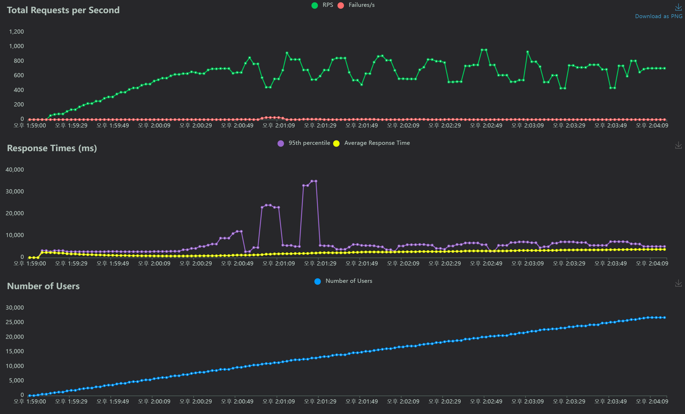
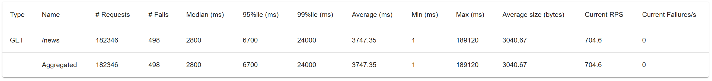
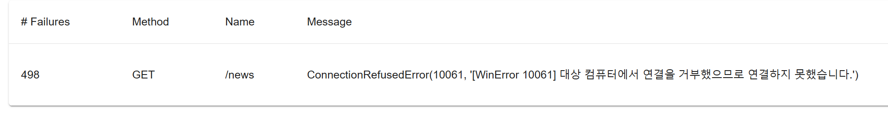

# backend-news

안전 뉴스를 다음 사이트에서 스크래핑하여 제공합니다.<br>
안전 뉴스는 redis cache에 저장합니다.<br>
뉴스 스크래핑 시간은 매 3시간 마다입니다.

### 제공 정보

- 기사 제목
- 기사 내용 미리보기
- 신문사
- 날짜 (N분, N일, N달전, 0000. 00. 00.)
- 썸네일
- 기사 링크

### requirements.txt

```
APScheduler==3.10.4
asgiref==3.8.1
autopep8==2.1.0
beautifulsoup4==4.12.3
bs4==0.0.2
certifi==2024.2.2
charset-normalizer==3.3.2
Django==5.0.4
django-apscheduler==0.6.2
django-cors-headers==4.3.1
django-redis==5.4.0
django-rest-framework==0.1.0
djangorestframework==3.15.1
idna==3.7
pycodestyle==2.11.1
pytz==2024.1
redis==5.0.3
requests==2.31.0
six==1.16.0
soupsieve==2.5
sqlparse==0.5.0
tzdata==2024.1
tzlocal==5.2
urllib3==2.2.1
```

### Locust

- 차트
  
- 통계
  
- 실패
  

=> ConnectionRefusedError(10061, '[WinError 10061] 대상 컴퓨터에서 연결을 거부했으므로 연결하지 못했습니다.')
이외에는 실패없이 news값을 받을 수 있었음.
