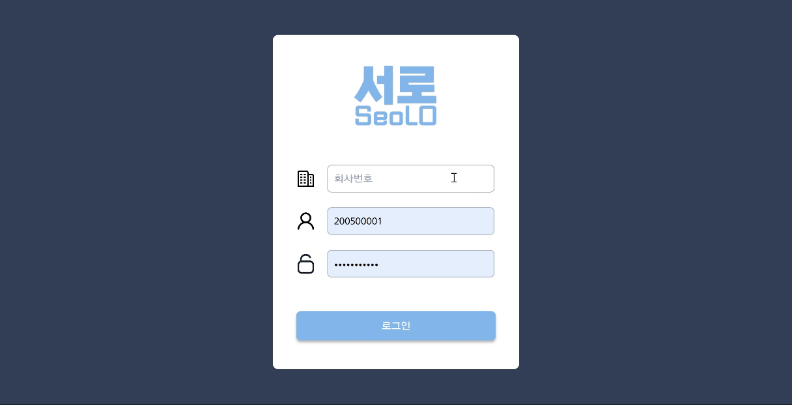

## 사용예시

### 사용예시 목차

[WEB](#web) 
[APP](#app) 
[WATCH](#watch) 

---

### WEB

- 로그인 
  

- 도면 추가, 마커 등록 
  

- 도면 자물쇠 실시간 알림 및 업데이트 
  

- 장비 등록 
  

- 작업자 등록 
  

- 자물쇠 현황 
  

- 보고서 수정 
  

- 보고서 자동 생성 
  

- csv로 내보내기 
  

---

### APP

APP Usage

- 안전뉴스 
  

- 프로필, 내 작업내역 확인 
  .jpg>)
  .jpg>)
  

- 타인 작업내역 확인 
  

- 작업 등록, 잠금 
  
  .jpg>)
  .jpg>)
  .jpg>)
  .jpg>)
  .jpg>)

- 잠금 해제 
  
  

- LOTO 절차 
  

---

### WATCH

- LOTO 시작 
  

- 체크리스트 확인 

  > 체크리스트를 점검합니다. 모든 체크리스트를 점검 후에 다음 작업을 할 수 있습니다.  >  > 

- 공장 선택 
  

- 장비 선택 
  

- 날짜 선택 
  

- 시간 선택 
  

- 자물쇠 선택 
  

- 잠금 성공 
  

- 잠금 해제 
  
