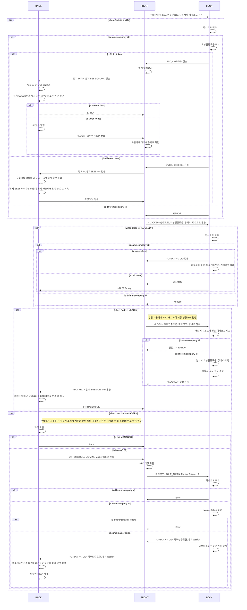

### sequence diagram - 인증로직

```mermaid
sequenceDiagram
    participant B as BACK
    participant F as FRONT
    participant L as LOCK

    F->>+L: <INIT>상태코드, 외부인증토큰, 유저의 회사코드 전송
    par when Code is <INIT>
        L->>+L: 회사코드 비교
        alt is same company id
            L->>+L: 외부인증토큰 비교
            alt is NULL token
                L->>+F: UID, <WRITE> 전송

                F->>F: 일지 입력받기
                F->>B: 일지 DATA, 유저 SESSION, UID 전송
                B->>B: 일지 저장(상태 <INIT>)
                B->>B: 유저 SESSION과 매치되는 외부인증토큰 여부 확인
                alt is token exists
                    B-->>F: ERROR
                else is token none
                    B-->>B: 새 토큰 발행
                    B->>F: <LOCK>, 외부인증토큰 전송
                    F->>F: 자물쇠에 태크해주세요 화면
                end
            else is different token
                L->>F: 장비ID, <CHECK> 전송
                F->>+B: 장비ID, 유저SESSION 전송
                B->>B: 장비ID를 활용해 가장 최신 작업일지 정보 조회
                B->>B: 유저 SESSION(사원ID)를 활용해 자물쇠에 접근한 로그 기록
                B->>F: 작업정보 전송
            end
        else is different company id
            L->>+F: ERROR
        end
    end

    F->>+L: <LOCKED>상태코드, 외부인증토큰, 유저의 회사코드 전송
	par when Code is <LOCKED>
		L->>+L: 회사코드 비교
        alt is same company id
            alt is same token
                L->>F: <UNLOCK>, UID 전송  
                L->>L: 자물쇠를 열고, 외부인증토큰, 기기번호 삭제
            else is null token
                L->>F: <ALERT>
                L->>B: <ALERT> log
            end
        else is different company id
            L-->>F: ERROR
        end
	end

    par when Code is <LOCK>
        Note right of F: 열린 자물쇠에 NFC 태그하여 해당 행동코드 진행
        F->>L: <LOCK>, 외부인증토큰, 회사코드, 장비ID 전송
        L->>L: 내장 회사코드와 받은 회사코드 비교
        alt is same company id
            L-->>+F: 불일치시 ERROR
        else is different company id
            L-->>L: 일치시 외부인증토큰, 장비ID 저장
            L-->>L: 자물쇠 잠금 로직 수행
            L-->>F: <LOCKED>, UID 전송
        end

        F->>B: <LOCKED>, 유저 SESSION, UID 전송
        B->>B: 로그에서 해당 작업일지를 LOCKED로 변경 후 저장
        B->>F: [HTTP1] 200 OK
    end

    par when User is <MANAGER>
        Note right of B: 관리자는 기계를 선택 후 마스터키 버튼을 눌러 해당 기계의 잠금을 해재할 수 있다. (비밀번호 입력 필수)

        B->>B: 자격 확인
        alt is not MANAGER
            B->>F: Error
        else is MANAGER
            B->>F: 권한 정보(ROLE_ADMIN), Master Token 전송
            F->>F: NFC 태깅 화면
            F->>L: 회사코드, ROLE_ADMIN, Master Token 전송
            L->>L: 회사코드 비교
            alt is different company id
                L->>F: Error
            else is same company ID
                L->>L: Master Token 비교
                alt is different master token
                    L->>F: Error
                else is same master token
                    L->>F: <UNLOCK>. UID, 외부인증토큰, 유저session
                    L->>L: 외부인증토큰, 기기번호 삭제
                    F->>B: <UNLOCK>, UID, 외부인증토큰, 유저session
                    B->>B: 외부인증토큰과 UID를 기준으로 정보를 찾아 로그 작성
                    B->>B: 외부인증토큰 삭제
                end
            end
        end
    end
```
