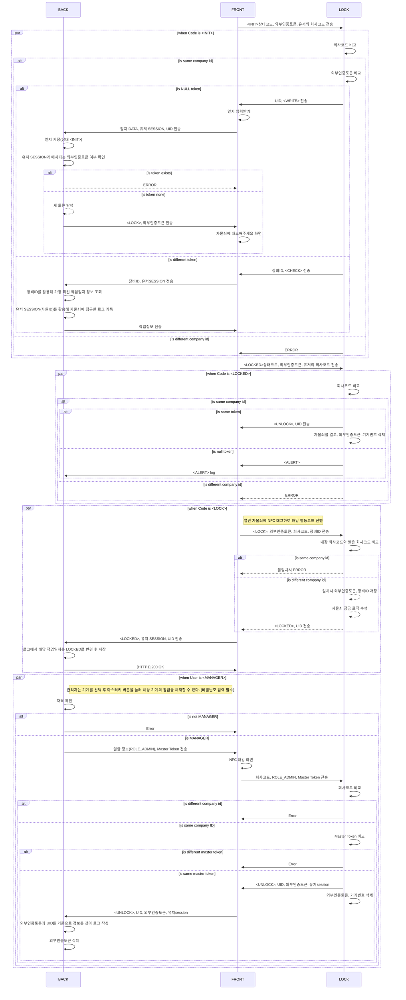

### sequence diagram - 인증로직

### ENUM LIST

LOTO 목적

- 수리
- 정비
- 청소
- 기타

작업자 상태 코드

- INIT
- LOCKED

사원 직급

- 임원
- 중간관리직
- 실무자
- 비정규직
- 그 외
- 생산직
    - 사원
    - 조장
    - 반장
    - 직장
    - 기원
- 연구직

사원 소속 (부서별)

- 인사
- 총무
- 기획
- 회계
- 연구개발
- 생산관리
- 생산기술
- 전산
- IT
- 영업
- 해외영업
- 품질관리
- 마케팅
- 생산
- 상품관리
- 생산기술

장비별 잠금장치 유형

- 전기 잠금장치
- 기동스위치 잠금장치
- 게이트밸브 잠금장치
- 볼밸브 잠금장치

회사코드 10byte

`AAA12345KR`

→ AAA : (앞 3자리) 회사 이름 이니셜 

→ 12345 : (중간 5자리) 회사분류 코드 (한국표준산업분류코드)

[한국표준산업분류코드](https://www.notion.so/a9496640aa1646a4833fa29eb9ffe626?pvs=21) 

→ KR: (맨 뒤 2자리)  

기계분류

- 공작기계 분류(중분류)는 다음을 따름

[한국공작기계산업협회-공작기계란-공작기계 종류](https://komma.org/user/industrial/type)
