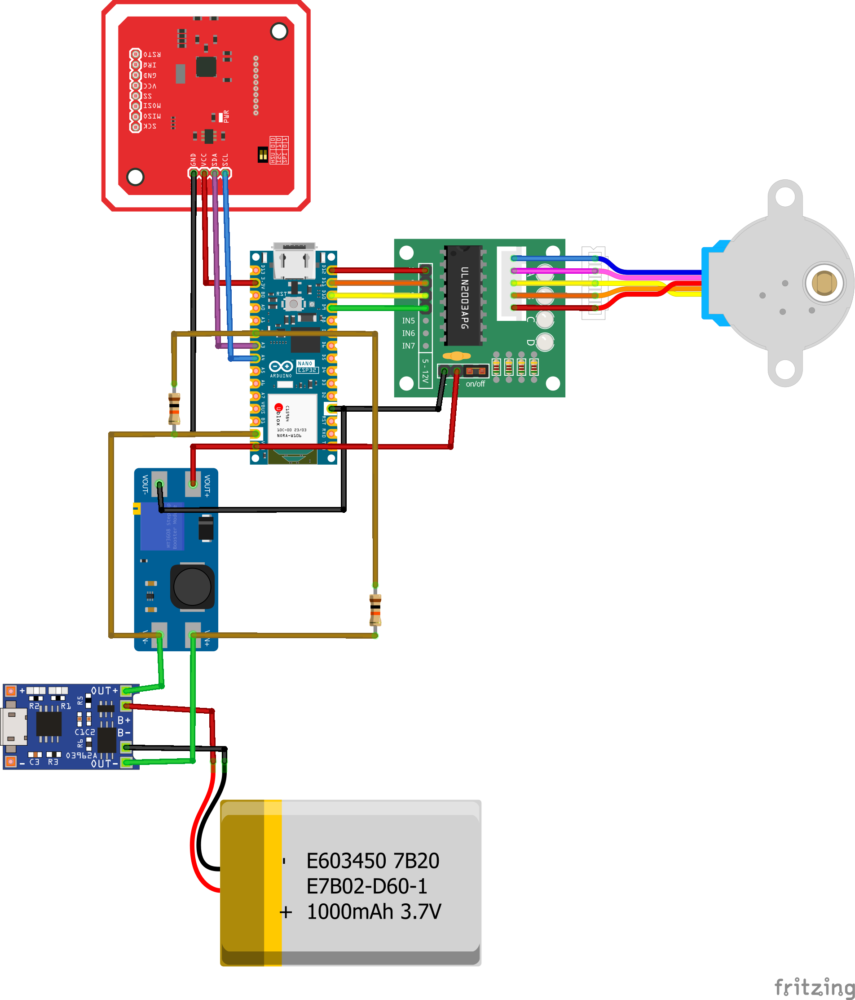
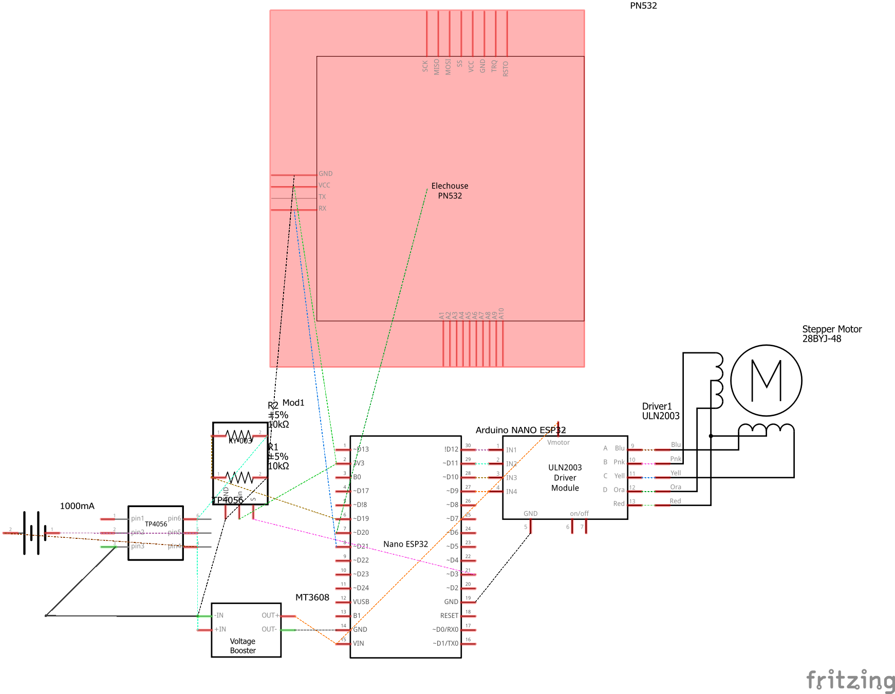
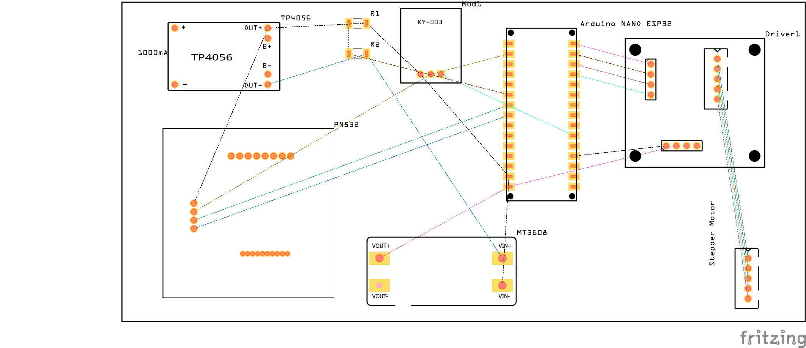

## embedded

> BLE기반 자물쇠를 제공합니다.<br>

### 제공 기능
- BLE OPEN/CLOSE
- NFC 마스터키
- C타입 충전
- Magnetic Sensor 활용한 잠금 확인

### 파일 구조
```
📦embedded
 ┣ 📂SEOLO 
 ┃ ┣ 📜SEOLO.fzz             // SEOLO fritzing FILE
 ┃ ┣ 📜SEOLO.ino             // arduino file
 ┃ ┣ 📜SEOLO.png             // 회로도
 ┃ ┣ 📜SEOLO_pcb.ps.png      // PCB
 ┃ ┗ 📜SEOLO_schem.png       // 스케메틱
 ┗ 📜README_EM.md
```

### 회로도
- 회로도
  
- 스케메틱
  
- PCB
  

### 부품 정보
```
- 아두이노 나노 ESP32 : 중앙 제어 및 블루투스
- 더한 TW102050 : 리튬 폴리머 배터리 3.7V 1000mAh 3.7Wh
- PN532 : NFC 모듈 3.3V
- 28BYJ-48 : 스텝모터 5V
- ULN2003 : 스텝모터 드라이버 모듈
- MT3608 : 승압모듈 (배터리 전압 3.7V --스텝업--> 5~6V )
- TP4056 : C타입 충전 모듈
- KY-003 : 마그네틱 센터 3.3V 
```

### 내부 사진
.jpg)
.jpg)
.jpg)

### 사용 라이브러리
```
// 내장 라이브러리
Arduino
base64
libb64/cdecode
Wire
sstream

// 추가 설치 라이브러리
ESP32_BLE_Arduino
AccelStepper
Preferences
AESLib
Adafruit_PN532
```

### 기여
- 조형찬 : 회로도 설계, HW 설계 및 조립, NFC, MOTOR, 배터리, C-type 충전, Magnetic Sensor
- 오유진 : BLE, Base64, AES128 (Core Logic), fritzing 작성
- 이현비 : 3D Modeling
- 오민상 : 회로 연결
- 김진명 : Serial Monitor Error 탐지, base64 library 탐색 도움
- 오정민 : 부품업체 컨택
